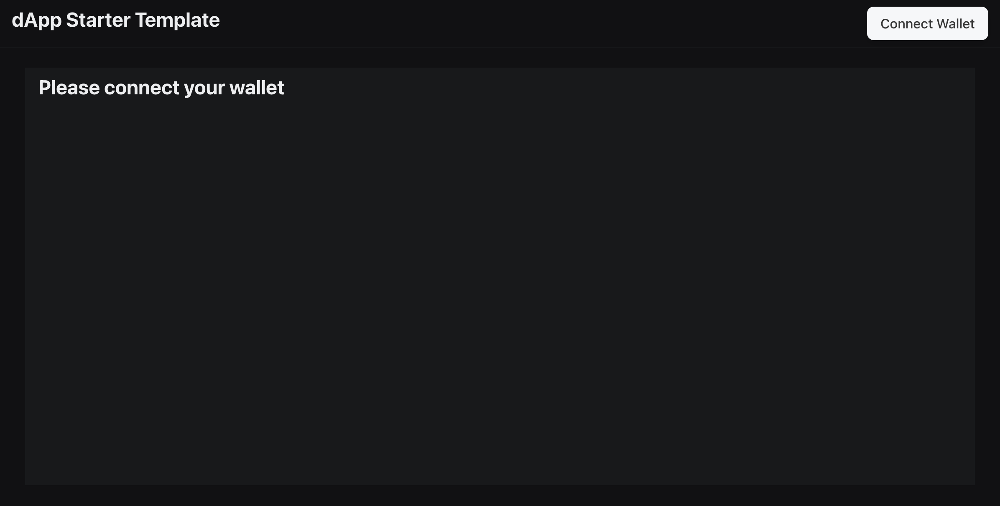
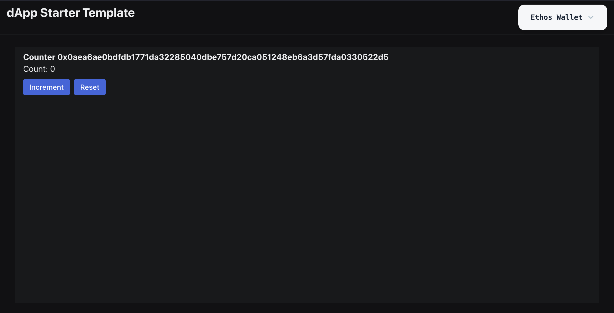
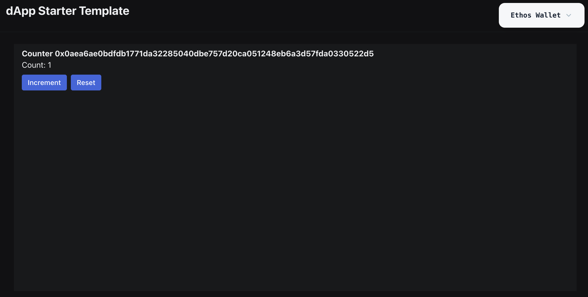

# Configuring a Sui Move dApp for Movement Network

In this guide for Sui developers, you'll learn how easy it is to create a Sui dApp React frontend and configure your dApp for Movement Network's M2 blockchain.

## Create a new Sui dApp project with `@mysten/create-dapp` 
```
pnpm create @mysten/dapp
```

([Install pnpm](https://pnpm.io/installation) first if needed.)

When you're prompted to choose a starter template, select `react-e2e-counter`.

Then give your app a unique name or use the default name, `my-first-sui-dapp`.

Navigate into your dApp's folder:

```
cd <your dapp name>
```
Open the dApp codebase with your favorite editor:
```
code .
```
Install dependencies:
```
npm install
```
And run your dApp locally:
```
npm run dev
```
Your dApp will appear in your browser:



## Configure your Sui dApp for Movement M2
Begin by adding Movement Network's `m2` into `networkConfig.ts` with the RPC url `https://devnet.m2.movementlabs.xyz:443`:

```
const { networkConfig, useNetworkVariable, useNetworkVariables } =
  createNetworkConfig({
    devnet: {
      url: getFullnodeUrl("devnet"),
      variables: {
        counterPackageId: DEVNET_COUNTER_PACKAGE_ID,
      },
    },
    mainnet: {
      url: getFullnodeUrl("mainnet"),
      variables: {
        counterPackageId: MAINNET_COUNTER_PACKAGE_ID,
      },
    },
    m2: {
      url: "https://devnet.m2.movementlabs.xyz:443",
      variables: {
        counterPackageId: M2_COUNTER_PACKAGE_ID,
      },
    },
  });
```
At the top of `networkConfig.ts`, import `M2_COUNTER_PACKAGE_ID`:
```
import {
  DEVNET_COUNTER_PACKAGE_ID,
  MAINNET_COUNTER_PACKAGE_ID,
  M2_COUNTER_PACKAGE_ID
} from "./constants.ts";
```

You can see that no package IDs are pre-configured in `constants.ts`.

```
export const DEVNET_COUNTER_PACKAGE_ID = "0xTODO";
export const MAINNET_COUNTER_PACKAGE_ID = "0xTODO";
```

To get a package ID, publish the `counter` package to M2. 

Navigate to the `counter` directory:

`cd move/counter`

Follow [this guide](https://docs.movementlabs.xyz/developers/sui-developers/using-sui-cli) to use Sui CLI.

Or [use `movement sui`](https://docs.movementlabs.xyz/developers/movement-cli/movement-sui/client/publish).

(Add the `--skip-dependency-verification` flag in your `publish` command if prompted.)

Once the package is published, get the ID from `Transaction Data` under `Object Changes` > `Published Objects`.

We'll use `0x76f85cd75c8e7ebac57382ea08a5c90eb2bf3128e4be68710bab67c9834fd35b` here for demonstration purposes.

In `constants.ts` export `M2_COUNTER_PACKAGE_ID`:

```
export const DEVNET_COUNTER_PACKAGE_ID = "0xTODO";
export const MAINNET_COUNTER_PACKAGE_ID = "0xTODO";
export const M2_COUNTER_PACKAGE_ID = "0x76f85cd75c8e7ebac57382ea08a5c90eb2bf3128e4be68710bab67c9834fd35b"
```
Now you can set the default network to M2 in `main.tsx`!
```
<SuiClientProvider networks={networkConfig} defaultNetwork="m2">
```
## Using your counter dApp on M2
To use the dApp, first configure a Sui wallet to M2. 

On Sui Wallet and Ethos Wallet, you click the gear icon, then "Network", then "Custom", and paste in the M2 RPC url `https://devnet.m2.movementlabs.xyz:443`.

Copy your wallet address and visit the [Movement Faucet](https://faucet.movementlabs.xyz/?network=testnet) to airdrop yourself some M2 tokens.

They'll show up as "SUI" in the wallet. We are very early to Movement Network (no Token Generation Event yet) so we use the native Aptos and Sui token names for now.

Now the fun part! Connect your wallet to your dApp and create a counter!



You (and anyone else) can increment it:



And only you can reset it back to 0.

## What dApps will you build on Movement?

Now you know how to configure a Sui Move dApp for M2.

Check out `CreateCounter.tsx`, `Counter.tsx` and `counter.move` to understand the app's frontend and onchain logic. As a challenge, try modifying it to increment by 2 each time a user increments. 

We can't wait to see what dApps you build and deploy to Movement Network!
